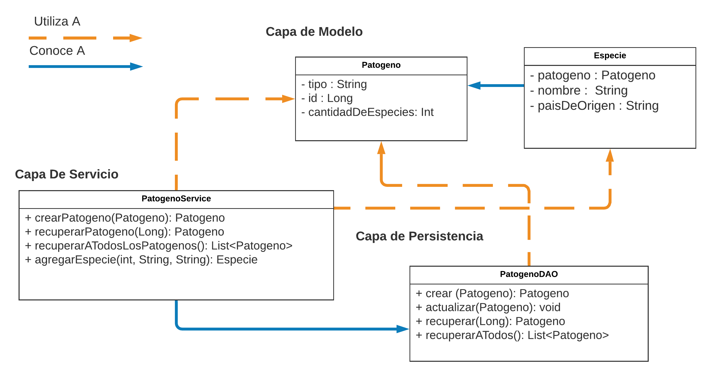

## Entrega 1 - JDBC

El líder del equipo de científicos del laboratorio con el cual nuestra compañía está trabajando se reúne con nosotros y nos comparte el conocimiento necesario para comenzar con la implementación de nuestro simulador. Nos cuenta que se denomina patógeno a todo agente biológico externo que se aloja en un ente biológico, dañando de alguna manera su anatomía. Los patógenos pueden ser de varios tipos: Virus, bacterias, hongos entre otros. Y para cada tipo de patógeno existen varias especies conocidas: Gripe, Sarampión, Paperas son diferentes especies de virus. 

  

	
Se nos pide tener un módulo que nos permita administrar los diferentes tipos de patógenos posibles con sus características básicas (tipo) y donde puedan registrarse las diferentes especies conocidas para ese patógeno.
Luego de horas de discusión y planeamiento, el líder técnico llega a nosotros con la siguiente interfaz:

  

La interfaz `PatogenoDAO` declara los siguientes métodos que nosotros debemos implementar:

- `crear(patogeno: Patogeno): Patogeno` - Recibe un objeto `Patogeno` y se encarga de persistirlo en la base de datos. Devuelve el mismo objeto con pero con el id asignado. 

- `actualizar(patogeno: Patogeno)` - Actualiza el Patogeno recibido por parámetro.

- `recuperar(idDelPatogeno: Long): Patogeno` - Este método devolverá la Patógeno cuyo id sea igual al provisto por parámetro. Se espera que este método devuelva, a lo sumo, un solo resultado.

- `recuperarTodos(): List<Patogeno>` - Este método deberá devolver una lista de todos los patógenos existentes ordenados alfabéticamente por su tipo en forma ascendente.

El equipo de front estara utilizando la interfaz  `PatogenoService`  para comunicarse con nuestro equipo. Este servicio debera implementar metodos que utilizaran al DAO, sumado al siguiente metodo:

- `agregarEspecie(idDelPatogeno: Long, nombreEspecie: String, paisDeOrigen : String) : Especie` - Debera lograr que se genere una nueva Especie del Patogeno. Por el momento no nos interesa persistir esa nueva especie, pero si llevar la cuenta de la cantidad de especies del Patogeno.

### Se pide:
- Que provean implementaciones para las interfaces descritas anteriormente, haciendo uso de todo lo visto en clase.
- Asignen propiamente las responsabilidades a todos los objetos intervinientes, discriminando entre servicios, DAOs y objetos de negocio.
- Creen test que prueben todas las funcionalidades pedidas, con casos favorables y desfavorables.
- Provean un archivo .sql con las sentencias DDL que sean necesarias para crear el schema de la base de datos (create tables).
