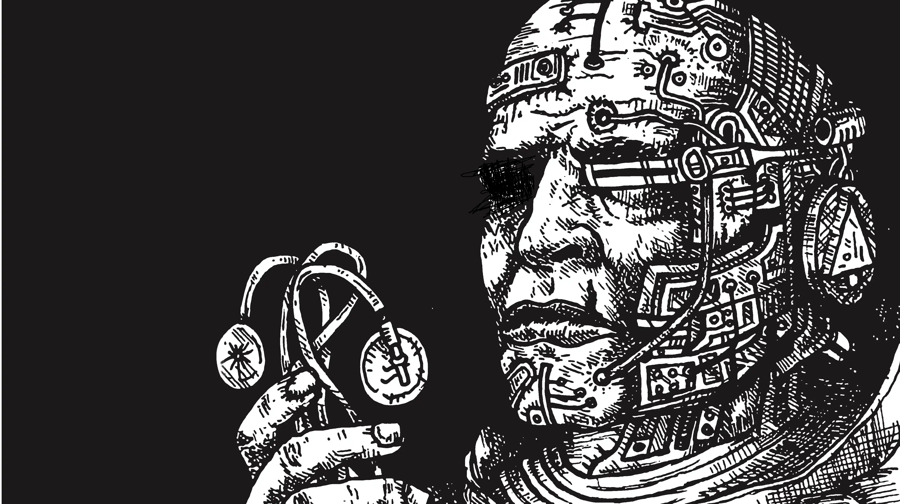

## Entrega 3 - ORM Spring

## Una vez mas con los científicos del laboratorio

Después de cumplir con los últimos requerimientos solicitados en su anterior visita al laboratorio, parten de la empresa donde desarrollan para presentar los progresos al grupo de científicos y recibir indicaciones sobre qué hacer para continuar avanzando con el proyecto.

Dentro del laboratorio, son recibidos en una pequeña y lúgubre sala de proyecciones. Allí, unos pocos científicos observan los avances con caras taciturnas, pero dejando entrever aquí y allá algún gesto de aceptación.

Luego de la presentación, entra en la habitación el amable lider científico con ojos cansados y un guante negro en su brazo que habían visto antes, indicándoles ahora que lo sigan para mostrarles de qué se tratará la próxima iteración sobre la simulación. No evitan observar que se lo ve un poco mas cansado y palido de la ultima vez que lo vieron, pero eligen no darle importancia.

Sin palabras de por medio, los lleva a un largo pasillo poco iluminado donde pueden verse varios tubos de cristal dispuestos muy ordenadamente uno detrás del otro. Dentro de las terribles jaulas, pueden divisar difícilmente lo que parecerían ser siluetas humanas bañadas por una luz mortecina que las hace parecer como si estuvieran suspendidas en el tiempo y en el espacio.

El científico, sin dar muchos rodeos, les indica que estos son especímenes enfermos con uno de los viruses bio-mecánicos que están afectando el mundo.

Desde su lugar y ya acostumbrados a la falta de luz, se toman unos segundos para observar más de cerca a los especímenes. Ven como uno de ellos tiene enormes garras que parecerían estar hechas de metal. Otro tiene ojos rojos brillantes que pareserían emitir un resplandor antinatural. Uno más atrás se lo ve con una piel escamosa y brillante, casi como si estuviera cubierta de metal líquido. Otros enfermos mas avanzados, apenas parecen humanos.

Sin esperar a que terminen de examinar los especímenes, el científico les informa que de esto se tratará la próxima iteración en nuestra simulación.

## Funcionalidad

## Mutaciones

<p align="center">
  
</p>

Hasta el momento, las especies no eran más que una iteración concreta de un patógeno. No había mucha diferencia entre una y otra. A partir de ahora, nos interesará diferenciar a las especies entre sí por las mutaciones que pueden causar en los vectores que enferman.

Una mutación es una nueva característica que los vectores podrán obtener a medida que su enfermedad empeora y hará que ciertas reglas de nuestra simulación cambien dependiendo de la mutación generada.

Cada vez que un vector contagie exitosamente a otro vector, se deberá analizar si la especie contagiada genera una mutación en el vector que contagio la enfermedad. Para esto, se deberá resolver la **Capacidad de biomecanización** de esa especie como porcentaje de éxito.

Ejemplo:

Un vector humano, llamémosle **John**, contagia con **Meca-Viruela** a un vector insecto. **Meca-Viruela** es un virus cuyo atributo de **Capacidad de biomecanización** es igual a 30. Eso significará que en el momento en el que **John** consiga contagiar la **Meca-Viruela**, tendrá un 30% de contraer una mutación al azar de la lista de mutaciones que tenga **Meca-Viruela**.

### Tipos de mutaciones 

Por el momento nos interesara solo simular dos tipos de mutaciones:

## Supresion biomecanica

Esta mutacion permite a la enfermedad defenderse y eliminar a otras enfermedades competidoras.

Viene acompañada de un numero del 1 al 100 que representa la potencia de esta mutacion.
Cuando un vector muta con **Supresion biomecanica**, se eliminaran todas las otras especies que el vector tenga que posean una **defensa contra otros micro-organismos** menor al poder de esta mutacion. 
Asi mismo, la mutacion no permitira que otra enfermedad con menor capacidad de defensa afecte a su vector.

Ejemplo:

**John** tiene tres enfermedades: **CromaColera**, **Meca-Viruela** y **RoboRabia**.

**John** contagia **Meca-Viruela** y muta con **Supresion biomecanica**, una de las mutaciones disponibles en **Meca-Viruela**. Esta mutacion tiene una potencia de 35.

En ese momento entonces se fija: **CromaColera** y **RoboRabia** tienen una defensa contra micro-organismos igual o superior a 35?

Digamos que **CromaColera** tiene 30 de defensa, y **RoboRabia** 35.

Como **CromaColera** tiene menos defensa que el poder de la mutacion de **Supresion biomecanica**, es eliminada y **John** ya no se encuentra enfermo por **CromaColera**.

Como **RoboRabia** tiene 35 de defensa, no pasa nada y **John** sigue enfermo.


Luego de resolver la mutacion, entonces **John** solo tendra las enfermedades: **Meca-Viruela**, y **RoboRabia**.

Digamos ahora que otro vector intenta contagiar a **John** con una nueva enfermedad, **Circuitomialgia**, la cual tiene una defensa de 15. 

**John** no podra ser contagiado por esta enfermedad, ya que su mutacion de **Supresion biomecanica** lo impedira.


## Bioalteracion genetica

Esta mutacion viene acompañada de un **tipo de vector**: Humano, insecto o animal.

Cuando se contrae, a partir de ese momento le permite al vector contagiar la enfermedad que genero la mutacion al tipo de vector asociado sin importar las restircciones previas.

Ejemplo:

**John** es un vector de tipo humano, no puede contagiar animales, pero contrae **RoboRabia**, la contagia, y muta contrayendo la mutacion de **Bioalteracion genetica** de tipo animal.

A partir de ese momento, John podra contagiar animales con **RoboRabia**.

**Recuerden**: Esta nueva regla solo se aplica para la enfermedad que genero la mutacion.


### Aclaraciones:

- La especie puede crearse y mantenerse sin ninguna mutacion disponible, en ese caso, por mas que el porcentaje de generar mutacion es exitoso, no generara ninguna nueva mutacion en el vector.
- Un vector puede tener varias mutaciones repetidas siempre y cuando estas se correspondan a distintas enfermedades que contrajo.

Ejemplo:

**John** contrajo la mutacion de **Supresion biomecanica** de **Meca-Viruela**. Esa mutacion tenia una potencia de 5.

Luego es enfermdado por otra especie, **RoboRabia**, con una **Defensa contra bio-organismos** de 10. Como esa proteccion es mayor que la potencia de la mutacion que tenia **John**, la **RoboRabia** no es eliminada.

Mas adelante, **John** contagia la **RoboRabia** y esa misma enfermedad le vuelve a generar la misma mutacion de **Supresion biomecanica** a partir de la RoboRabia, e intentara eliminar a las otras enfermedades que puedan llegar o esten afectando a **John**.

- Las mutaciones no se eliminan si la especie es eliminada del vector. 

Digamos que la **RoboRabia** que afecta a John, al generar la mutacion de **Supresion biomecanica** con una fuerza de 20, elimina a la **Meca-Viruela** que tenia de su organismo.

La mutacion que habia generado la **Meca-Viruela** sigue estando y sigue teniendose en cuenta y aplicandose. 
Esto nos importa por que en un futuro puede que nos sea importante analizar la cantidad de mutaciones que lleva un organismo.

## DTO

Una vez terminadas las charlas con los científicos, presto, vuelven a su trabajo de investigación dejándolos parados en una sala de espera con una cafetera y unas revistas "Gente" para leer. Mientras se preguntaban si se podían retirar ya o no, ven como el líder técnico se acerca y les comenta sobre grandes avances que estuvo realizando el equipo de Frontend los cuales ya poseen una interfaz semi-funcional lista como prototipo, y nos comenta que para comenzar con la integracion, necesistaria que le definamos DTOs (Data Transfer Object) para que comiencen con la implementacion.
Sera nuestro trabajo entonces definir los DTOs.

## Servicios

Se pide que se agregue el siguiente servicio:

### MutacionService

- agregarMutacion(especieId:Long, mutacion:Mutacion) - Agrega la mutacion a la lista de posibles mutaciones de la especie.

### Integracion a Spring
Además, nos interesara:

- Pasar la transaccionalidad de todos los servicios a Spring
- Que los DAOs implementen la interfaz de Spring 'CRUDRepository' en lugar del DAO genérico previsto en el TP anterior.
- Crear controllers REST para todos los servicios implementados hasta ahora y los implementados en este TP también.
- Crear DTOs para generar un contrato de comunicación con el front. Dichos DTOs tienen que ser aprobados por el equipo docente, que se pondra como representador del equipo de frontend.

### Se pide:

- Que provean implementaciones para las interfaces descriptas anteriormente.

- Creen test que prueben todas las funcionalidades pedidas, con casos favorables y desfavorables.


## BONUS: Handleo de errores

Se ven impulsados a salir del laboratorio, con imágenes perturbadoras aún palpitantes en sus retinas. 
Allí, bajo el suave resguardo de un árbol y rodeado de una fortaleza de libros, casi como si buscara refugio en el conocimiento, se encuentra el joven ayudante al que habian asistido la última vez que vinieron al laboratorio.

Cruzan dos segundos las miradas y el reconocimiento es mutuo. Sin embargo, al levantarse precipitadamente y tropezando con su propia bata, desata una avalancha literaria sobre la cual queda enterrado. 
Lo ayudan a salir del aprieto y entre risas el desorden queda rápidamente olvidado.

Ya sentados a su lado, el ayudante científico habla con una emoción desbordante, pintando un cuadro de progresos y avances gracias a los servidores liberados por la ayuda que prestaron la última vez que estuvieron en el laboratorio. 

Aunque su energía y pasión inicial por compartir los avances y mejoras de los últimos tiempos irradia con una luz propia, una sombra gradualmente comienza a opacar su semblante.

"Veran... hay algo que necesito que sepan. El guante del líder no es mero adorno", confiesa con un susurro ahogado.

A continuacion, relata cómo meses atrás, el líder fue víctima de una cruel ironía del destino, siendo contaminado por una cepa temprana del Mechanus E534. Un tratamiento en fase experimental frenó la corrupción de su carne, pero no pudo evitar la metamorfosis de su brazo en una máquina futurista y compleja. Esta extensión mecánica, con hilos fusionados a su sistema nervioso, le otorga capacidades casi divinas para procesar información y analizar datos a velocidades inimaginables.

Dentro del laboratorio el secreto solo se mantuvo durante unos pocos meses, convirtiéndose prontamente en uno a puertas abiertas. Todos están fascinados con los nuevos poderes y el brazo mecánico del líder científico, una integración de hombre y máquina nacida de la tragedia, ahora convertido en una herramienta de esperanza.

Aquel brazo, previamente desaprovechado debido a los servidores saturados, se ha convertido ahora luego de la ayuda que ustedes proveyeron en la clave del progreso. Pero el ayudante sospecha que este don podría convertirse en su perdición. La maquinaria, aunque poderosa, también es susceptible, y en esta situacion Mechanus E534 podria aprovechar cualquier brecha de seguridad para infiltrarse a través de este brazo y alcanzar los servidores.

Allí, en ese pequeño claro rodeado de naturaleza, con el sonido de las hojas susurrando secretos ancestrales, el equipo se encuentra frente a una encrucijada: la esperanza y el peligro, la ciencia y la humanidad, la luz y la oscuridad, todo entrelazado en un complejo tapiz que ahora debían ayudar a desentrañar.

## Implementación bonus

Se nos pide implementar un handleo de errores en nuestra API, personalizando las respuestas de los controllers de la manera más descriptiva posible. Nuestro objetivo es no dejar que los clientes o consumidores de nuestra API obtengan la información directa de que es lo que causó el error (un stacktrace), si no, un error con descripción humana que nos sirva no solo para comunicar algún error de uso de la API, sino también para ocultar cualquier tipo de información sensible.

Como recomendación, piensen que excepciones deben de handlear y que código de respuesta lo representa mejor. Por ejemplo, si se quiere crear una especie con un nombre repetido, la mejor descripción para el error sería algo del estilo:

```
  response_code: 400
  description: No se puede crear una especie con nombre repetido
```

Como segundo requerimiento, se pedirá que se creen dos 2 tests de controllers (end-to-end e integración), donde deberán simular las peticiones de la API para testear su funcionamiento. De esta forma, podremos asegurarnos que de entrada a salida, la aplicación funciona como esperamos que lo haga para los test que lleguen a cubrir.

## Consideraciones:
El bonus no es necesario para aprobar, pero de ser implementado correctamente sumará nota. Una mala implementación NO restará nota, aún así, recuerden no invertir esfuerzos en el bonus a costa de la implementación principal del TP que es donde las correcciones si afectan la nota final.
