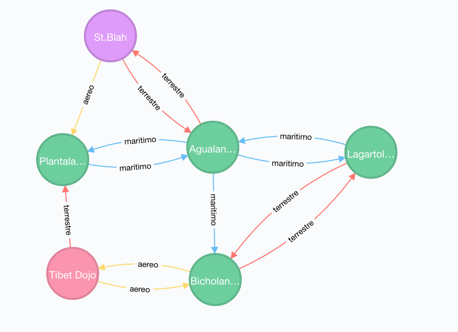

Fue una semana agotadora de labor sin descanso, de noches aciagas donde la cordura se desvanecía lentamente, azotada por las escalofriantes visiones que habian contemplado en aquel tenebroso cuarto del laboratorio en que las mutaciones eran manipuladas y confinadas en prisiones de cristal. En contraste, cada amanecer traía consigo la esperanza de un futuro más brillante encabezado por el lider científico con su brazo mecanico: una abominación convertida en el estandarte y promesa de una nueva era dorada.

Sacudiéndose del letargo y escapando de las agobiantes visiones, exhaustos pero avivados al fin y al cabo por la satisfacción del deber cumplido, se reunen con su equipo de desarollo y se adentran una vez más en el laboratorio, esperando obtener nuevos requerimientos de los cientificos para continuar con la simulacion.

Inmediatamente al pisar el umbral, pueden sentir algo siniestro en el ambiente. Cuando ustedes se acercan, los cientificos se corren a un lado, evitan su mirada, pero ustedes elijen no darle importancia y encaminan directo a la sala de proyecciones donde el lider cientifico solia recibirlos. Sin embargo, al llegar, encuentran únicamente a su asistente, quien como los demás, se lo nota algo nervioso.

Se predisponen a saludarlo animosamente, pero sin darles tiempo de hacer indagaciones, y sin levantar la vista, les presenta rápidamente los nuevos requerimientos y, con una urgencia poco característica, les insta a abandonar el lugar cuanto antes.

No estan tan seguros que es lo que esta sucediendo en el laboratorio, pero algo huele mal. Antes de salir por la puerta principal, vislumbran por el rabillo del ojo la entrada del cuarto de las prisiones de cristal; pueden ver que un líquido viscoso y oscuro se desliza por debajo de la puerta.

## Entrega 4 - NoSQL - Neo4J

  

Como bien habíamos aprendido, en nuestro sistema existen las ubicaciones. Todo vector tiene actualmente una ubicación y es posible que los vectores se muevan de ubicación en ubicación.
Los del laboratorio sin embargo, les dicen que la representación actual del concepto de ubicaciones se queda corto, y necesitan ampliar un poco su definición y comportamiento.

### Movimiento

Es poco real que los vectores se esten moviendo de una ubicación a otra ubicación sin restricción, casi como si pudieran teletransportarse.  Para hacernos cargo de esta irregularidad, se nos confía el modelado más real de ubicaciones.

En un principio, las ubicaciones deberían estar conectadas entre sí por medio de un camino, y un vector que necesite ser movido sólo debería poder moverse a una ubicación conectada a la ubicación donde está.

Los caminos se categorizan en tres tipos:

- Caminos terrestres : Que pueden ser atravesados por todos los tipos de vectores
- Caminos marítimos: Que pueden ser atravesados por humanos y animales
- Caminos aéreos: Que solo pueden ser atravesados por insectos y animales.

  

## Servicios

Se deberan realizar las siguientes modificaciones al `UbicacionService`:

- El mensaje `mover`  deberá ser reimplementado de forma de que:
    - Arroje una excepción `UbicacionMuyLejana` si no es posible llegar desde la actual ubicación del vector a la nueva por medio de un camino.
    - Arrojar una excepción `UbicacionNoAlcanzable` si se intenta mover a un vector a través de un tipo de camino que no puede atravesar.

- El mensaje `crearUbicacion` deberá ser re-implementado de tal forma que cree la ubicación tanto en hibernate como en Neo4j.

- Se deberá implementar el metodo `conectar(nombreDeUbicacion1:String, nombreDeUbicacion2:String, tipoCamino:String)` que conecte dos ubicaciones (se asumen preexistentes) por medio de un tipo de camino. Desde la ubicacion 1, a la ubicacion 2.

- Se deberá implementar el metodo `conectados(nombreDeUbicacion:String): List<Ubicacion>` que dado el nombre de una ubicacion, retorne todas las ubicaciones conectadas por cualquier tipo de camino desde la ubicacion dada. En otras palabras: Los diferentes caminos que un vector tendria la posibilidad de elegir a la hora de moverse de la ubicacion provista.

- Se deberá crear un mensaje `moverPorCaminoMasCorto(vectorId:Long, nombreDeUbicacion:String)` que funcione como el mover, pero que el vector intente llegar a la ubicación dada en la menor cantidad de movimientos.
Hay que tener en cuenta que:

  -No todos los tipos de vectores pueden moverse por los mismos tipos de caminos.
  
  -De no poder llegar de ninguna forma a la ubicacion destino se debera lanzar la excepcion `UbicacionNoAlcanzable`

### Se pide:
- Que ademas de modificar el UbicacionService, tambien Modifiquen el UbicacionController para que se puedan realizar las llamadas al service desde el front. 
- Que la evaluacion sobre si el vector puede moverse a traves de un tipo de camino se resuelva enteramente con la base de datos
- El objetivo de esta entrega es implementar los requerimientos utilizando una base de datos orientada a grafos.
- Creen test unitarios para cada unidad de código entregada que prueben todas las funcionalidades pedidas, con casos favorables y desfavorables.

### Recuerden que:
- Los caminos no son bidireccionales. Todo camino tiene una dirección. Los caminos bidireccionales serán sencillamente modelados como dos caminos en direcciones opuestas.

## Implementacion Bonus 

## Nuevas mutaciones

Se nos indica que si bien fue un buen comienzo, las mutaciones implementadas hasta el momento no son una representación fehaciente de la variedad y cantidad de mutaciones que están azotando al mundo en la vida real. En esperanzas de acortar esta brecha, se nos pide que implementemos dos nuevas mutaciones:

- ElectroBranqueas:

Modifica el sistema respiratorio del vector, permitiendo a sus pulmones filtrar el oxígeno del agua y expedir la materia no utilizada.
El vector afectado por esta mutación podrá moverse por caminos marítimos independientemente de su tipo de vector.

- Propulsion Motora:

Una protuberancia viscosa, negra y mecánica crece en la espalda del vector afectado, encorvando su figura por el peso de dicha instalación, pero permitiéndole moverse por caminos aéreos independientemente de su tipo de vector.

## Capacidad de expansión

Para poder analizar la capacidad de expansión de un patógeno; se deberá crear un mensaje `capacidadDeExpansion(vectorId: Long, nombreDeUbicacion:String, movimientos:Int): Int` que dado un vector, retorna la cantidad de diferentes ubicaciones a las que podría moverse el Vector dada una cierta cantidad de movimientos.

## Consideraciones:

El bonus no es necesario para aprobar, pero de ser implementado correctamente sumará nota. Una mala implementación NO restará nota, aún así, recuerden no invertir esfuerzos en el bonus a costa de la implementación principal del TP que es donde las correcciones si afectan la nota final.
